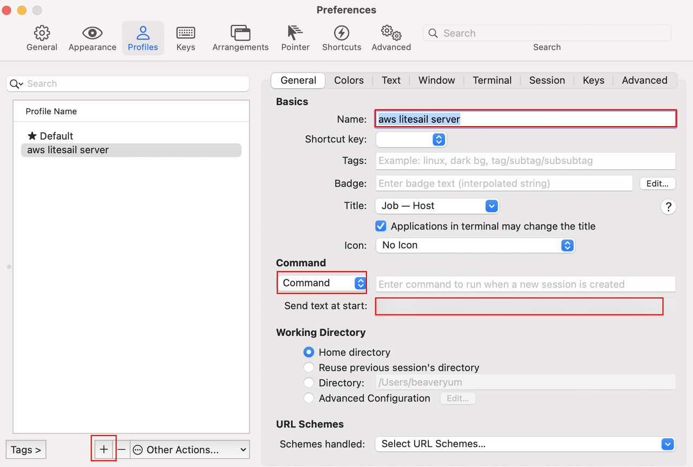

# {{ $frontmatter.title }}

다른거 보고 참고해서 다시 포스트 글 올립니다.

(맥 운영체제 빅서 이상에서 테스트한 자료입니다.)

1. 서버 아이피를 알아둔다.

https://lightsail.aws.amazon.com/ls/webapp/home/instances

2. 라이트세일에서 키를 다운받거나 생성한다.

https://lightsail.aws.amazon.com/ls/webapp/account/keys1

다운받은 펌 키의 퍼미션을 변경한다. chmod 600 xxxx.pem (절대 400 아님)

iTerm2 > Preferences > Profiles 접근한다.

1. 왼쪽 하단 맨아래 판넬 +로 새 추가한다.

2. Name에 적당한 이름을 입력!

3. Command 드롭다운 메뉴에서 Command 선택한다.

4. Send text at start 텍스트 입력칸에 ssh -i /pem파일이 위치한 절대경로 centos@IP 입력!

(예: ssh -i /Users/hof/Documents/mykey.pem -p 22 bitnami@192.168.0.1 )

그리고 나서 확인!

먄약에 포트가 바뀐거면 -p 1234 로 사이에 넣어준다.

그냥 메뉴바를 확인해서 Profile 누르면 아까 생성한 서버 이름을 선택하면 된다.

그러면 알아서 iterm2 새창이 띄워준다.

비밀번호 제대로 입력만하면 된다.

아래 자료 참고해서 한건데 몇가지 틀린게 있어서 다시 수정해서 올립니다.

비밀번호 자동으로 넣는 방법은 여기꺼 참고한다.

https://velog.io/@tkaqhcjstk/%EB%A7%A5%EB%B6%81-iterm2-ssh-%EC%9E%90%EB%8F%99-%EB%A1%9C%EA%B7%B8%EC%9D%B8-%EC%84%B8%ED%8C%85%ED%95%98%EB%8A%94-%EB%B2%95

## 참고 자료 :

https://velog.io/@tkaqhcjstk/%EB%A7%A5%EB%B6%81-iterm2-ssh-%EC%9E%90%EB%8F%99-%EB%A1%9C%EA%B7%B8%EC%9D%B8-%EC%84%B8%ED%8C%85%ED%95%98%EB%8A%94-%EB%B2%95

https://hof.pe.kr/8194

