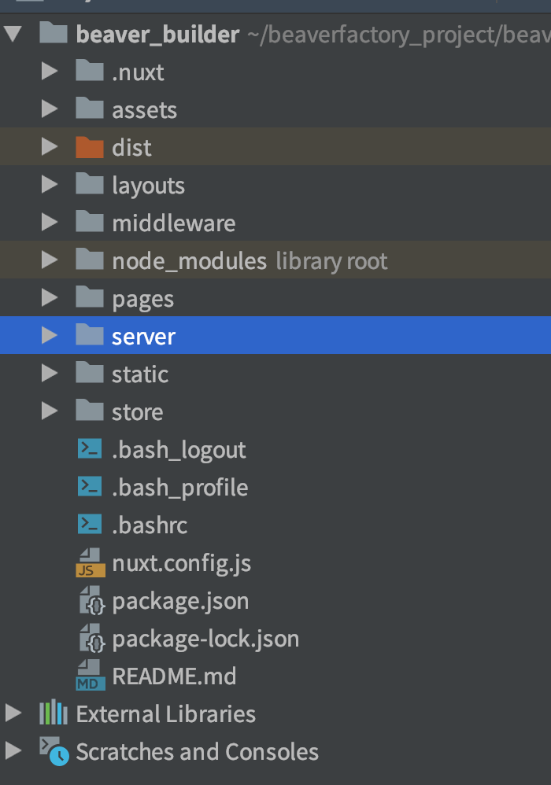

# {{ $frontmatter.title }}


아래 설정 파일은 frontend 와 backend 위주로 폴더 분리 해야된다.

소스코드

```bash
server {

listen 80;

server_name toyci4vue.beavertech.or.kr;

client_max_body_size 2G;

access_log /var/log/nginx/ci4_toy_vue.access.log;

error_log /var/log/nginx/ci4_toy_vue.error.log;

error_page 500 502 503 504 /50x.html;

autoindex off;

charset utf-8;

root /home/ci4_toy_vue/frontend/dist;

​

location / {

try_files $uri $uri/ /index.html;

index index.html index.htm;

}

​

location /api {

root /home/ci4_toy_vue/backend/public;

rewrite ^/api/(.*)$ /$1 break;

try_files $uri $uri/ /index.php?/$request_uri;

index index.php;

}

​

location ~ \.php$ {

set $newurl $request_uri;

if ($newurl ~ ^/api/(.*)$) {

set $newurl $1;

root /home/ci4_toy_vue/backend/public;

}

​

fastcgi_split_path_info ^(.+\.php)(/.+)$;

include fastcgi_params;

fastcgi_pass php_worker;

fastcgi_index index.php;

fastcgi_param SCRIPT_FILENAME $document_root$fastcgi_script_name;

fastcgi_intercept_errors off;

fastcgi_buffer_size 16k;

fastcgi_buffers 4 16k;

}

​

if (!-e $request_filename ) {

rewrite ^(.*)$ /index.php last;

}

location ~ /\. {

deny all;

}

location ~ ^/(app|system|vendor|Themes|tests)/ {

return 403;

}

}
```

여기서 추가적으로 nuxt 기준으로 한다면?

서버폴더는 내부에 따로 있음

```bash
server {
        listen       80;
        server_name beaverbuilder.beavertech.or.kr;
        root /home/beaverbuilder/dist;
        index  index.html index.htm index.php;

        add_header X-Frame-Options "SAMEORIGIN";
        add_header X-XSS-Protection "1; mode=block";
        add_header X-Content-Type-Options "nosniff";

        access_log /var/log/nginx/beaverbuilder.access.log;
        error_log   /var/log/nginx/beaverbuilder.error.log;

        error_page  404              /404.html;
        error_page   500 502 503 504 /50x.php;

        location = /50x.php {
            root   /etc/nginx/block;
        }


        # 접근 제한 -  업로드 디렉토리에서 PHP 실행 제한
        location /writable/ {
            location ~ \.(php|html|htm|inc)$ {
              deny all;
            }
        }


        location / {
           try_files $uri $uri/ /index.html;
           index index.html index.htm;
        }


        location /api {
           root /home/beaverbuilder/server/public;
           rewrite ^/api/(.*)$ /$1 break;
           try_files $uri $uri/ /index.php?/$request_uri;
        }

        location ~ \.php$ {
            set $newurl $request_uri;
            if ($newurl ~ ^/api/(.*)$) {
              set $newurl $1;
              root /home/beaverbuilder/server/public;
            }

            fastcgi_split_path_info ^(.+\.php)(/.+)$;
            include fastcgi_params;
            fastcgi_pass php_worker81;
            fastcgi_index index.php;
            fastcgi_param SCRIPT_FILENAME $document_root$fastcgi_script_name;
            fastcgi_intercept_errors off;
            fastcgi_buffer_size 16k;
            fastcgi_buffers 4 16k;
        }

        if (!-e $request_filename ) {
            rewrite ^(.*)$ /index.php last;
        }

        location ~ ^/(app|system|vendor|tests)/ {
            return 403;
        }

        location = /favicon.ico { access_log off; log_not_found off; }
        location = /robots.txt  { access_log off; log_not_found off; }

        error_page 404 /index.php;

        location ~ /\. {
            deny all;
        }
}
```

이렇게 내부에 server 폴더 있어야된다.





참고 자료 :


https://gist.github.com/mreschke/27bfafb84add38d3bab8