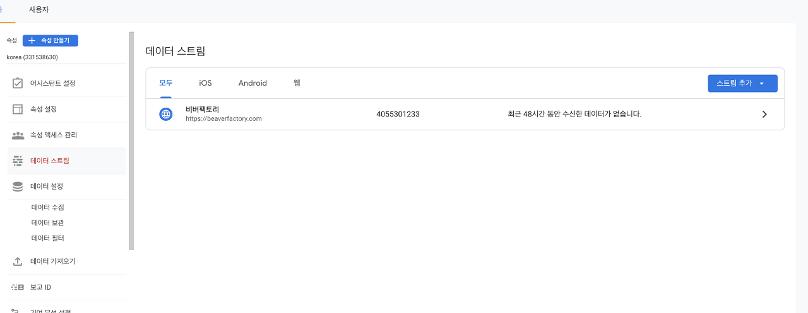

# {{ $frontmatter.title }}

위 자료를 참고 해도 안나와서 겨우야 찾았다.

캡쳐 이미지 참고하길..

우선 데이터 스트림을 누른다. (만약에 스트림이 없으면 추가버튼 누른다.)

여기서 태그설정 구성을 누른다. 그리고 오른쪽에 화살표를 누른다.

관리 버튼 누르고 밑에 태그 설치를 누르면 모달창이 나옵니다.

그리고 인스톨 매뉴어리 를 누르면 됩니다.