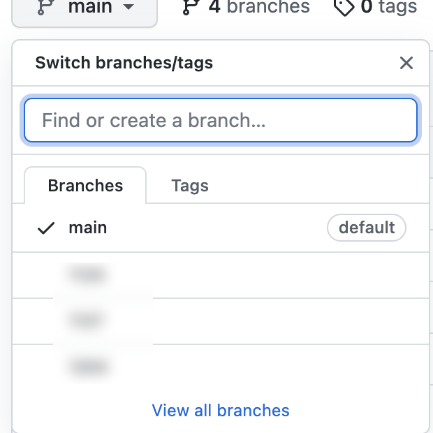

# {{ $frontmatter.title }}


1. find or create a branch 여기서 브랜치 이름을 입력 한다.

2. create a branch 라는 링크가 만들어지면 클릭하면 된다.




브랜치 에 등록하면 된다.

아래 명령어로 활용하면 된다.

```bash
git init git remote add origin https://github.com/~.git
git pull origin 브런치이름
git checkout -b 브런치이름
git add . git commit -m "어쩌구"
git push origin 브런치이름
```


문제 해결 방법

Q : 프로젝트 구조가 달라서 푸시에 문제가 발생 될 경우

A : .git 을 먼저 삭제 한다 (숨겨진 파일이라서 운영체제에 맞게 보이는파일로 변경 해야 된다.)


그리고 위에 브랜치 등록하는 방법을 그대로 사용한다. (명령어 그래도 사용함)


푸시 명령어만 따로 써주자

```bash
git push -u origin +<브런치명>
```

위에 명령어는 강제로 푸시한다는 뜻이다.


Q. 브랜치를 삭제 하고 싶다면?

리모트에서 삭제

```bash
git push origin --delete 브랜치명
```

로컬에서 삭제

```bash
git branch -d 브랜치명
```


Q. 여기서 해당 폴더를 제외 시키고 싶다면?

1. 프로젝트의 최상단 경로에 '. gitignore' 파일을 하나 생성해준다.


2. 내용은 node_modules 라고 만든다.

명령어를 입력한다.


```bash
git rm -r --cached . git add . git commit -m "now .gitignore is working" git push
```


여기서 아래 처럼 경고 메시지 나온다면?


fatal: The current branch final1_1 has no upstream branch. To push the current branch and set the remote as upstream, use

```bash
git push --set-upstream origin final1_1
```

위에 명령어 대로 똑같이 입력하면 된다.

```bash
git push --set-upstream origin final1_1
```


깃 연결 끊기

```bash
git remote remove origin
```


