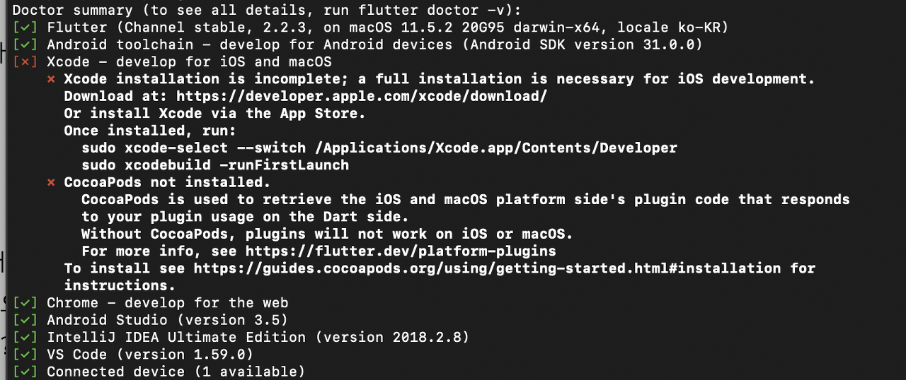
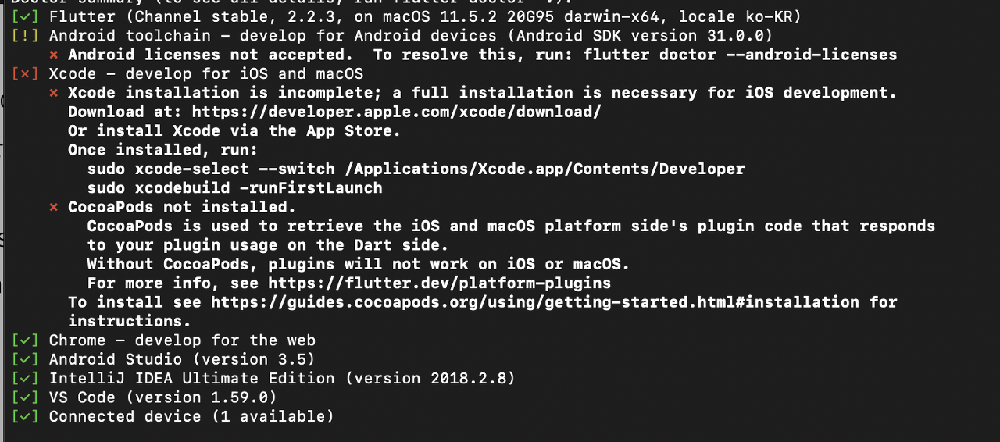
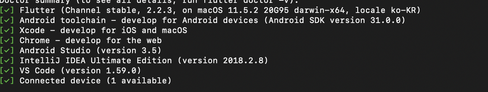

# {{ $frontmatter.title }}


요약 제대로 안했음..

플로터를 왜?

:::info
- 플로터를 왜 공부 하게 됐냐면? 앱을 만들때 안드랑 애플 앱 둘다 만들기 위해서 하이브리드로 할지 뭘로 할지 모르기 때문에 무작정 부딧혀 보기로 했다.
:::


사전에 미리 준비 해야될 것들

안드로이드 스튜디오 프로그램 툴

엑스코드 프로그램 툴


위에 툴을 설치하려면 여기 레퍼런스 참고 해서 설치 한다.


https://puzzle-puzzle.tistory.com/entry/Flutter-플러터-설치하기-Install-Flutter-for-Mac


https://spiralmoon.tistory.com/entry/Flutter-Mac에-Flutter-개발환경-설치하기


sdk 설치 하기

https://flutter.dev/docs/get-started/install/macos


혹시나 플러터 설치가 제대로 안됐을경우..

https://island-developer.tistory.com/78


위에 레퍼런스 보고 설치 하면된다.

```
vi .zshrc

export PATH=$PATH:~/flutter/bin

source ~/.zshrc
```


여기서 중요한게 경로는 알아서 지정 해야한다.

~ 물결 표시는 /users/사용자/ 해당 경로를 나타내는거다

혹시 모르면 터미널에 pwd를 입력해서 확인해본다.


나머지 플러터 닥터로 나머지 설치 해야된 부분을 알수있다.

```
flutter doctor
```

플로터 닥터를 입력하면 플로터에 문제가 되는부분이 출력된다.

일단 안드로이드 스튜디오 와 엑스코드 둘다 설치를 해둔다.

그리고 밑에 코코어패드? 를 미리 설치한다. 이게 엑스코드 설치 후에 이것도 설치 하라고 나와서 미리 설치 한다.

```
sudo gem install cocoapods
```





여기 위에 사진을 보면 xcode 에 문제가 된 부분이 있다 여기서 Once installed, run : 이렇게 써있다

아래 소스를 복붙해서 하나씩 붙어 넣기 하면된다.

```
sudo xcode-select --switch /Applications/Xcode.app/Contents/Developer
sudo xcodebuild -runFirstLaunch
```

만약에 안드로이드에서 문제가 되면...



아래 명령어 를 입력 하면 된다.

```
flutter doctor --android-licenses
```

이후에 전체 동의를 하면된다 귀찮지만 y를 눌러서... 쭈우욱...

이러고 마지막에 다시 flutter doctor 로 입력을 하면 문제가 없다고 출력된다.

이렇게 하면 모든 설치가 완료 됐었다.

나머진 알아서 구동하면된다.
