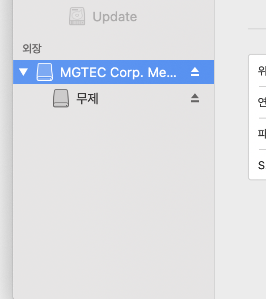
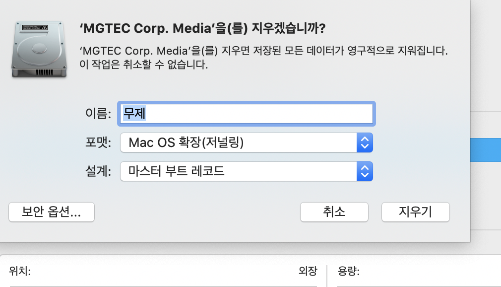

# {{ $frontmatter.title }}

디스크 유틸리티에서 해당 외장 하드를 지우기 누르면 아래처럼 알림 메시지가 나옵니다.

디스크를 마운트 해제 할 수 없습니다 69888

이럴때 포맷을 아예 못하는게 아니라 저처럼 따라 하면 됩니다.

(참고로 윈도우를 열 필요 없습니다.)

finder 창을 열어주시고 왼쪽에 보면 위치에 보면 분리된 외장하드가 보입니다.

여기서 전부다 추출을 해주세요 (오른쪽 버튼 눌러서 추출을 누르면 외장하드가 안보입니다.)

그러고나서 다시 한번 디스크 유틸리티로 접근합니다.

아래 이미지 처럼 나옵니다. 왼쪽에 세모 표시▼ 외장 버튼 누르면 상위랑 하위가 나누게 된걸 볼수있습니다. 여기서 상위에 있는것을 눌러주세요

그러고 나서 지우기 버튼 누릅니다. 포맷 형식을 아래처럼 맞춰줍니다.

  

근데 여기서 파티션으로해서 분리를 하고싶다면 설계에서 GUID 파티션 맵으로 선택해줍니다. 그러면 완료됩니다.

