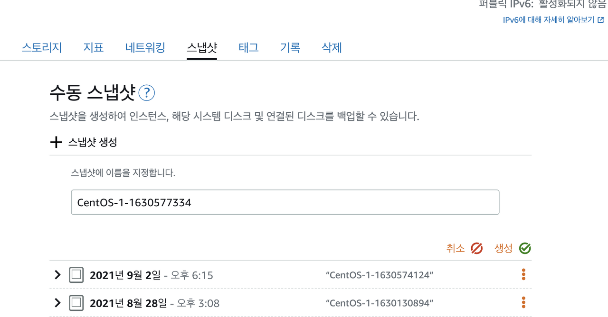
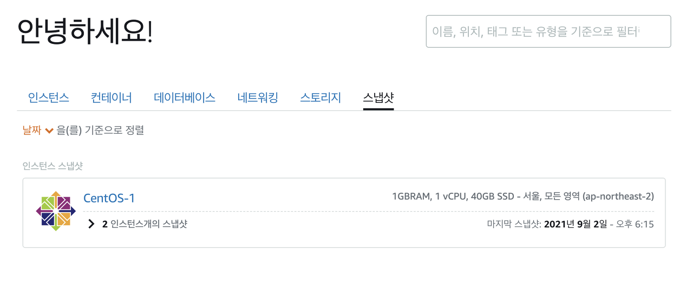
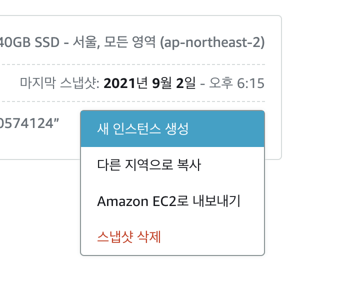
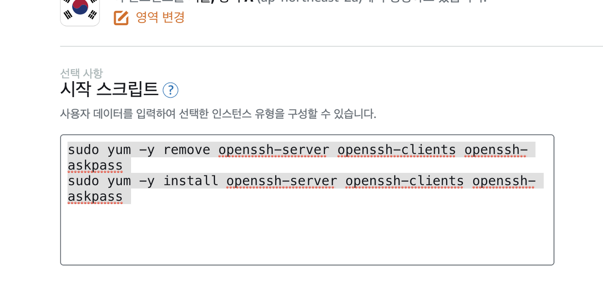

# {{ $frontmatter.title }}


센토환경에서 ssh 접속 불가 문제 생길 경우

## 원인 :

루트 비밀번호를 잊어버려서 접속을 못하거나 텀키를 잊어버려서 접속 못하는 상황이다.


## 해결 방법 :

1 . 해당 인스턴스에서 스냅샷를 하나 만든다.




2. 홈으로 접근해서 스냅샷을 접근한다.



3. 새 인스턴스 만들기




여기서 중요한게 펌키가 있는지 없는지를 확인해야됩니다. 펌키 없으면 새 인스턴스만들때 새로 생성하면됩니다.

만약에 펌키를 새로 생성하려면 맨 위에 메뉴바에 계정 ▼ 를 누릅니다.

그리고 계정 눌러서 접근하면 되고 여기서 프로필 및 연락처 옆에 ssh키 를 눌러서 접근합니다.

키페어 생성하기를 눌러주면 됩니다.

중요한게 펌키를 꼭 필수로 가지고 있어야됩니다.

여기서 새로 만들면 되지만 자주 만들면 보안에 취약할 수 있어서 주의해야됩니다.

4. 시작 스크립트에 추가한다.



```bash
sudo yum -y remove openssh-server openssh-clients openssh-askpass
sudo yum -y install openssh-server openssh-clients openssh-askpass
```

위에 명령어를 그대로 넣으면 된다.

그리고나서 인스턴스 명을 지정하고 인스턴스 생성 하기 누르면 된다.

(새 인스턴스 만들때 가격때랑 옵션 같은거는 변경 해도 되는데 필자 같은 경우에는 그냥 그대로 적용했습니다.)

스크립트쪽에만 넣었고 나머진 바뀐게 없이 그대로 적용 했습니다.

5. 브라우저 터미널을 접근한다.

이게 바로 되지 않아서 처음에 접근하고
"오류가 발생하여 인스턴스에 연결하거나 연결 상태를 유지할 수 없습니다. 이 인스턴스가 방금 시작된 경우 1~2분 후에 다시 시도하십시오."

이런 메시지가 뜬다면

1~3번정도 재부팅 을 하다보면 "로그인에 실패했습니다. 이 인스턴스가 방금 시작된 경우 1~2분 후에 다시 시도하십시오." 이 메시지가 나온다. 메시지가 분명히 나옵니다.

이때 putty 혹은 terminal로 접근해서 계정 로그인 하면 접속 됩니다.

포트번호는 당연히 22 포트로 하면 되고 비밀번호는 필요 없이 그냥 펌키만 적용해주면 됩니다.

참고로 요금은 그대로 나옵니다. 하루정도만 소요했기 때문에..