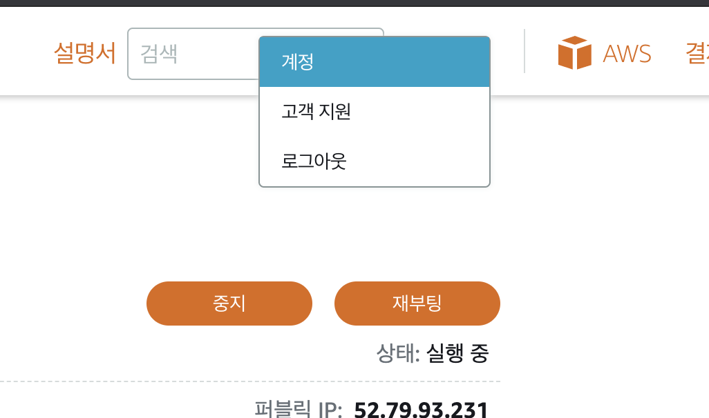
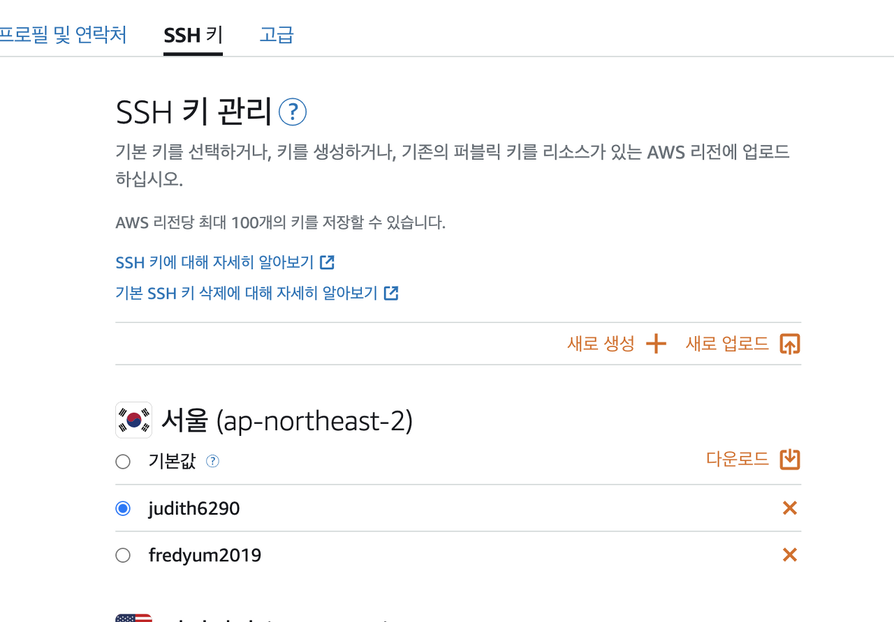

# {{ $frontmatter.title }}

새 텀키를 만드는 방법에 대해서 설명 하겠습니다.

방법은 간단합니다. 그림 보고 따라 하면 된다.

## 1. 위에 보면 계정이라고 클릭하면 된다.

## 2. 계정을 누르면 이동됩니다.

여기서 ssh 키라고 탭버튼 누른다.

여기서 새로 생성이라고 저걸 누르면 된다.

SSH 키 페어 리전 이라고 뜨는데 당연히 한국 서울 누르면 된다.

여기선 알아서 응용해서 새로 만들면 된다.