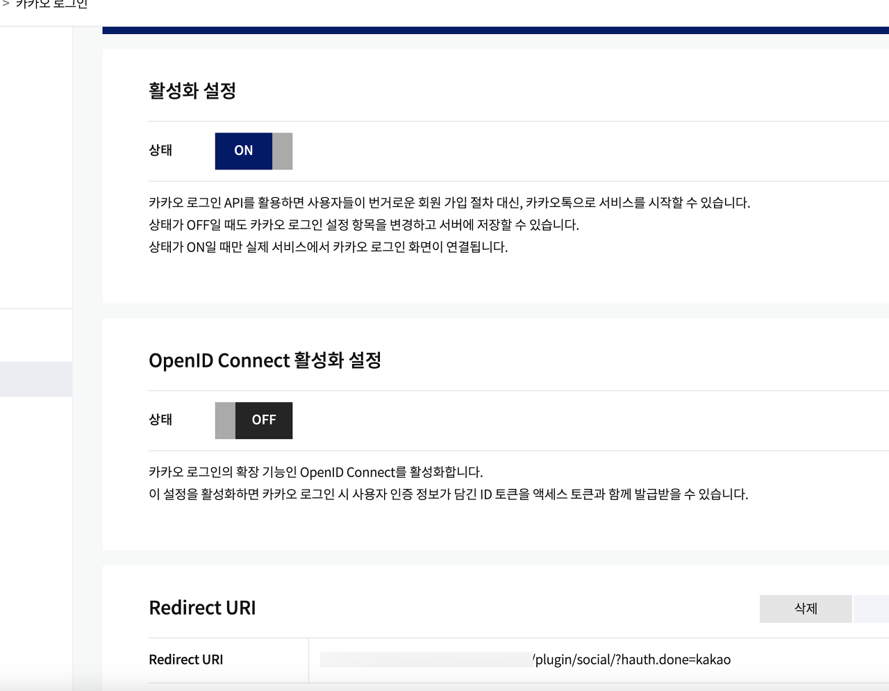
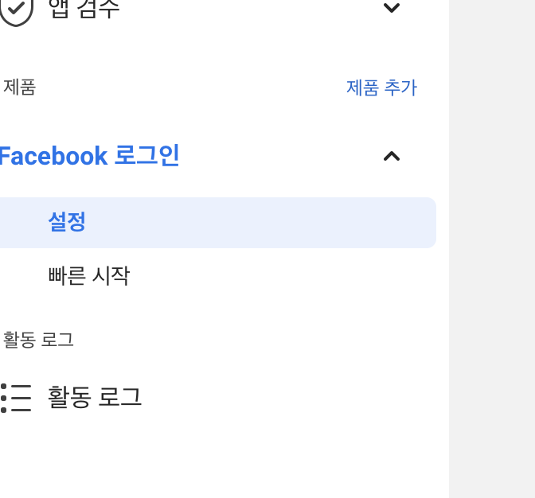
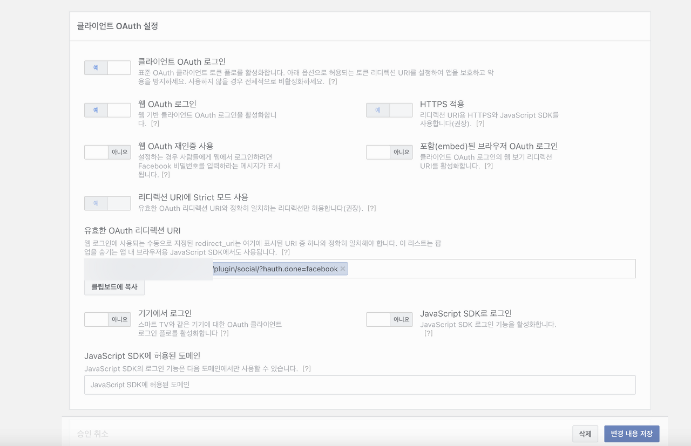

# {{ $frontmatter.title }}

## 설명 :

필수준비물 각각 시리얼넘버 그누보드 sns 탭누르면 이동된다.

여기서 네이버는 기본적으로 쉽고 

카카오는 아래 이미지를 보고 설정하면된다. 

oauth 설정 하면된다. 

활성화 설정 on 설정해주고 

리다이렉트 주소를 넣어주면 된다. 

 

페이스북은 앱을 만든후에 왼쪽에 메뉴 보면 아래 그림처럼 페이지 이동한다.

 

클라이언트 oauth 설정에 리다이렉트 주소를 등록만하면된다. 

 

나머지는 응용하면 된다.

 