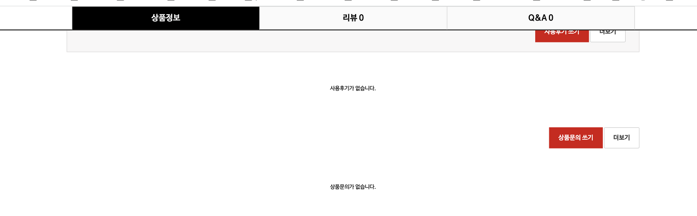

# {{ $frontmatter.title }}


## 설명 :


제이쿼리 ) 상세페이지에서 탭버튼 스크롤 내릴시 헤더 고정 하고 id 일치하면 탭버튼 메뉴 엑티브로 렌더링 하기

 


이거 참고하면된다. 


소스는 이렇다.

```js
$(function (){
    $(window).scroll(function() {
        var windscroll = $(window).scrollTop();
        var offset = $('.tabsTit').offset().top;
        if (windscroll >= offset) {
            $('.tabsTit').addClass('fixed_tabsTit');
            $('#wrapper .tabsList').each(function(i) {
                if(windscroll > $("#"+$(this).attr('id')).offset().top) {
                    $('.tabsTit .tabsTab').removeClass('tabsHover');
                    $('.tabsTit .tabsTab').eq(i).addClass('tabsHover');
                }
            });
        } else {
            $('.tabsTit').removeClass('fixed');
            $('.tabsTit .tabsTab').removeClass('active');
            $('.tabsTit .tabsTab:first').addClass('active');
        }
    });
 
    $('.tabsTit .tabsTab').on('click',function () {
        $(this).addClass('tabsHover').siblings().removeClass("tabsHover");
    });
});

```


백단 소스코드

```php
<ul class="tabsTit sanchor">
    <li class="tabsTab tabsHover tab-first"><a href="#sit_inf">상품정보</a></li>
    <li class="tabsTab"><a href="#sit_use">리뷰 <span class="item_use_count"><?php echo $item_use_count; ?></span></a></li>
    <li class="tabsTab"><a href="#sit_qa">Q&A <span class="item_qa_count"><?php echo $item_qa_count; ?></span></a></li>
</ul>
 
<div id="wrapper"><!-- <div id="wrapper"> -->
    <!-- 상품 정보 시작 { -->
    <div id="sit_inf" class="tabsList">
        <h2>상품정보</h2>
        <?php if ($it['it_basic']) { // 상품 기본설명 ?>
            <h3>상품 기본설명</h3>
            <div id="sit_inf_basic">
                <?php echo $it['it_basic']; ?>
            </div>
        <?php } ?>

        <?php if ($it['it_explan']) { // 상품 상세설명 ?>
            <h3>상품 상세설명</h3>
            <div id="sit_inf_explan">
                <?php echo ($it['it_mobile_explan'] ? conv_content($it['it_mobile_explan'], 1) : conv_content($it['it_explan'], 1)); ?>
            </div>
        <?php } ?>
        <?php
        if ($it['it_info_value']) { // 상품 정보 고시
            $info_data = unserialize(stripslashes($it['it_info_value']));
            if(is_array($info_data)) {
                $gubun = $it['it_info_gubun'];
                $info_array = $item_info[$gubun]['article'];
                ?>
                <h3>상품 정보 고시</h3>
                <table id="sit_inf_open">
                    <colgroup>
                        <col class="grid_4">
                        <col>
                    </colgroup>
                    <tbody>
                    <?php
                    foreach($info_data as $key=>$val) {
                        $ii_title = $info_array[$key][0];
                        $ii_value = $val;
                        ?>
                        <tr>
                            <th scope="row"><?php echo $ii_title; ?></th>
                            <td><?php echo $ii_value; ?></td>
                        </tr>
                    <?php } //foreach?>
                    </tbody>
                </table>
                <!-- 상품정보고시 end -->
                <?php
            } else {
                if($is_admin) {
                    echo '<p>상품 정보 고시 정보가 올바르게 저장되지 않았습니다.
                        config.php 파일의 G5_ESCAPE_FUNCTION 설정을 addslashes 로
                        변경하신 후 관리자 &gt; 상품정보 수정에서 상품 정보를 다시 저장해주세요. </p>';
                }
            }
        } //if
        ?>
        <?php if ($default['de_baesong_content']) { // 배송정보 내용이 있다면 ?>
            <!-- 배송 시작 { -->
            <h2>배송정보</h2>
            <div id="sit_dvr">
                <h3>배송</h3>
                <?php echo conv_content($default['de_baesong_content'], 1); ?>
            </div>
            <!-- } 배송 끝 -->
        <?php } ?>
        <!-- 교환 시작 { -->
        <h2>교환정보</h2>
        <?php if ($default['de_change_content']) { // 교환/반품 내용이 있다면 ?>
            <div id="sit_ex">
                <h3>교환/반품</h3>
                <?php echo conv_content($default['de_change_content'], 1); ?>
            </div>
        <?php } ?>
        <!-- } 교환 끝 -->
    </div>
    <!-- } 상품 정보 끝 -->
    <!-- 사용후기 시작 { -->
    <div id="sit_use" class="tabsList">
        <h2>리뷰</h2>
        <div id="itemuse"><?php include_once(G5_SHOP_PATH.'/itemuse.php'); ?></div>
    </div>
    <!-- } 사용후기 끝 -->
    <!-- 상품문의 시작 { -->
    <div id="sit_qa" class="tabsList">
        <h2>Q&A</h2>
        <div id="itemqa"><?php include_once(G5_SHOP_PATH.'/itemqa.php'); ?></div>
    </div>
    <!-- } 상품문의 끝 -->
</div><!-- <div id="wrapper"> --> 
```

     
 


